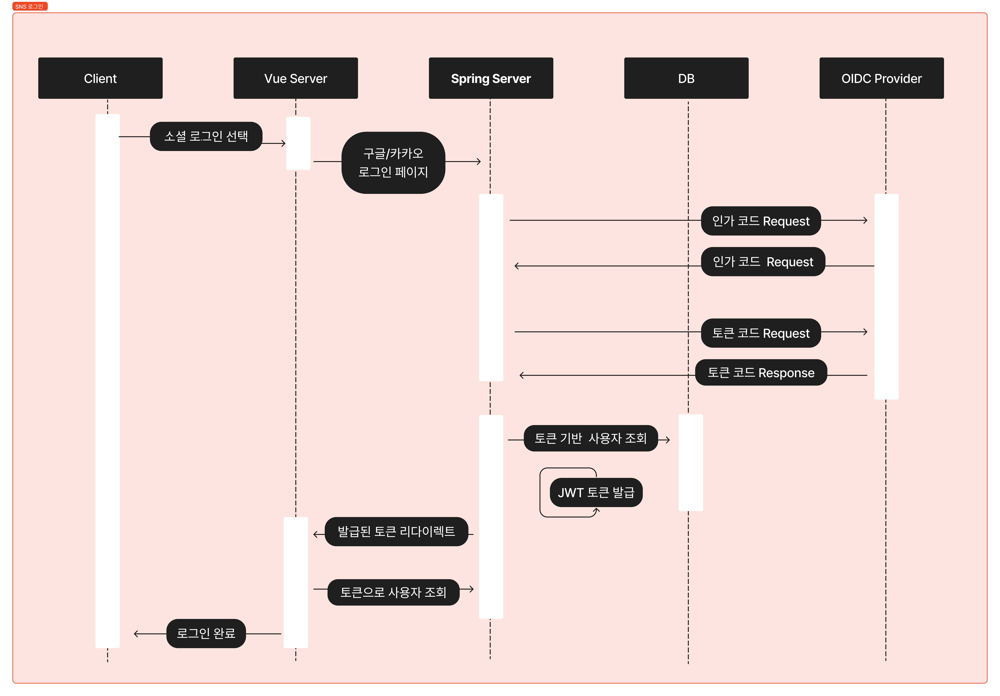
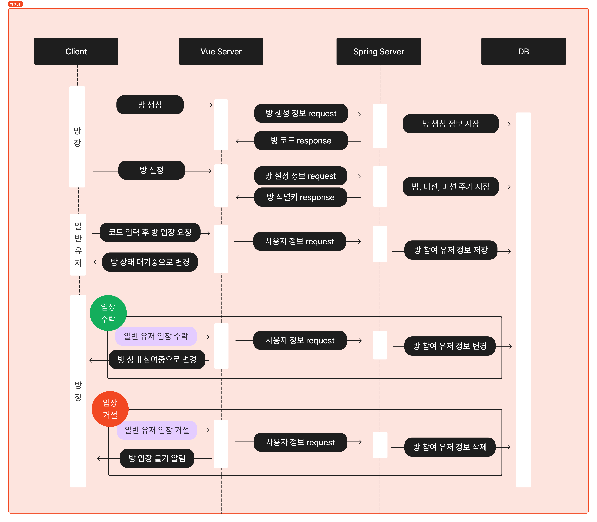
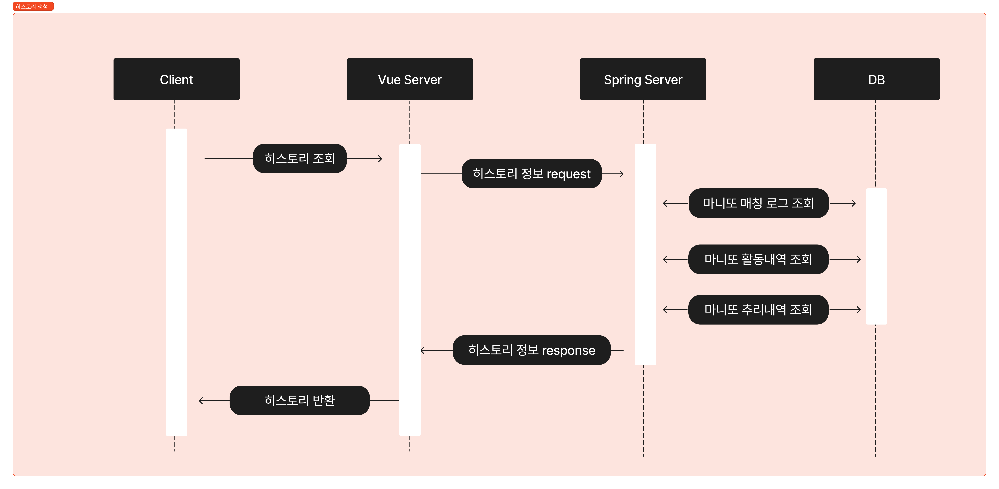

<div align="center">

</div>
<br/>

## Secreto?
**Secreto**는 **온라인 마니또 서비스**입니다. 오프라인에서 즐기던 마니또 활동을 온라인으로까지 확대하였습니다. 익명 채팅, 다양한 미션, 활동 기록 등 즐거운 서비스를 도입하였고 반응형 웹 디자인으로 모바일, 태블릿, PC 어떤 기기에서도 이용할 수 있습니다. 이제 Secreto로 언제 어디서든 마니또 활동을 즐겨보세요!

<h5>방 생성 화면</h5>
<br/>

<h5>채팅 화면</h5>
<br/>

<h5>히스토리 화면</h5>
<br/>

## 📃 Description
> <h3><font color="red">서비스 주요 기능</font></h3>
> <br/>
> <h3><font color="green">서비스 전체 기능</font></h3>
<ul>
	<li>매칭  기능 : 마니또를 매칭하는 기능</li>
	<li>마니또 그룹 관리 : 방장이 게임할 인원들을 모집하게 게임을 관리하는 기능</li>
	<li>미션 관리 기능 : 미션을 지정하거나 원하는 미션을 생성할 수 있는 기능</li>
	<li>채팅 기능: 마니또와 미니띠가 익명으로 채팅을 사용할 수 있는 기능</li>
	<li>요약 기능: 마니또가 수혜 받은 기록 등을 통계나 타임 라인을 통해서 한번에 볼 수 있도록 하는 기능</li>
	<li>게시판 기능: 자유롭게 마니또를 칭찬할 수 있는 게시물 작성 가능</li>
	<li>마니또 유추 기능 : 마니또가 누구인지 확인해볼 수 있는 기능</li>
</ul>
<br/>
<br/>

## 📝 Design
> <h3><font color="green">전체 기술 스택</font></h3>

>  > <br/>

> <h3><font color="green">전체 시스템 구조</font></h3>

>  > <br/>

> <h3><font color="green">ERD 다이어그램</font></h3>

>  > [링크](https://www.erdcloud.com/d/CxFthe8tLGuDJf3Bz) 바로가기
> <br/>

> <h3><font color="green">요구사항 정의서</font></h3>

>  <br/>

> <br/>
> <br/>

> <h3><font color="green">API 명세서</font></h3>

>  <br/>

> <br/>
> <br/>

> <h3><font color="green">화면 명세서</font></h3>

>  <br/>

> <br/>
> <br/>


## 💻Front-End
> <h3><font color="green">사용한 라이브러리</font></h3>

| 라이브러리       | 설명                                         |
| ---------------- | -------------------------------------------- |
|                  |                                              |

<br/>

> <h3><font color="green">디렉토리 구조</font></h3>

```markdown
(추후추가)
```

<br/>

> <h3><font color="green">아키텍처 구조</font></h3>

>  > <br/> > <br/>

## 💻Back-End
> <h3><font color="green">사용한 라이브러리</font></h3>

| 라이브러리                                  | 설명                                                                    |
| ------------------------------------------- | ----------------------------------------------------------------------- |
|                                             |                                                                         |

<br/>

> <h3><font color="green">디렉토리 구조</font></h3>

```markdown
(추후추가)
```

<br/>

> <h3><font color="green">패키지 다이어그램</font></h3>

> 

> 도메인 기준으로 패키지를 구분하였다.
> <br/>

> <h3><font color="green">SNS 로그인 과정</font></h3>

> <h3><font color="green">방 생성 과정</font></h3>

> <h3><font color="green">히스토리 생성 과정</font></h3>


## 👨‍👦‍👦 Team Member
> <h3><font color="red">Front-End</font></h3>
<table>
 <tr>
    <td align="center"><a href="https://github.com/JIINSUNG"></a></td>
    <td align="center"><a href="https://github.com/tooyul"></a></td>
    <td align="center"><a href="https://github.com/h-spear"></a></td>
  </tr>
  <tr>
    <td align="center"><a href="https://github.com/JIINSUNG"><b>지인성</b></a></td>
    <td align="center"><a href="https://github.com/tooyul"><b>신시원</b></a></td>
    <td align="center"><a href="https://github.com/h-spear"><b>김현창</b></a></td>
  </tr>
  <tr>
    <td align="center">프론트엔드 팀장</td>
    <td align="center"></td>
    <td align="center"></td>
  </tr>
</table>

> <h3><font color="red">Baek-End</font></h3>
<table>
 <tr>
    <td align="center"><a href="https://github.com/yee950419"></a></td>
    <td align="center"><a href="https://github.com/KrswJo"></a></td>
    <td align="center"><a href="https://github.com/namoo1818"></a></td>
  </tr>
  <tr>
    <td align="center"><a href="https://github.com/yee950419"><b>이상학</b></a></td>
    <td align="center"><a href="https://github.com/KrswJo"><b>조승우</b></a></td>
    <td align="center"><a href="https://github.com/namoo1818"><b>이민지</b></a></td>
  </tr>
  <tr>
    <td align="center">팀장, 백엔드 팀장</td>
    <td align="center"></td>
    <td align="center"></td>
  </tr>
</table>

## 🏷 License
<p>
This software is licensed under the MIT <a href="https://www.ssafy.com/ksp/jsp/swp/swpMain.jsp" _blank="new">©SSAFY</a>.
</p>

