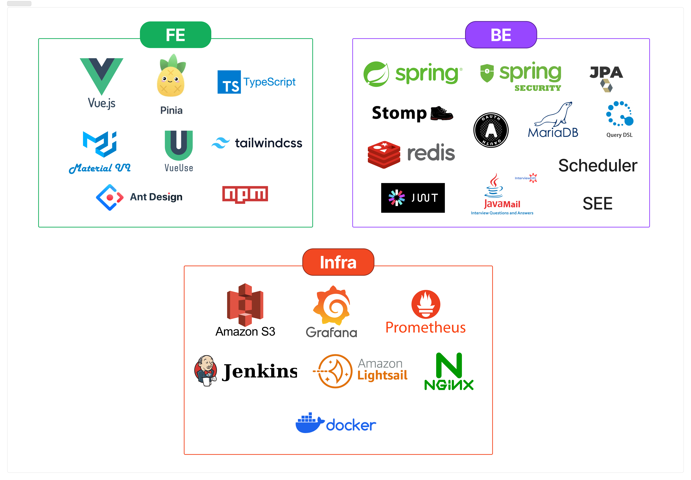
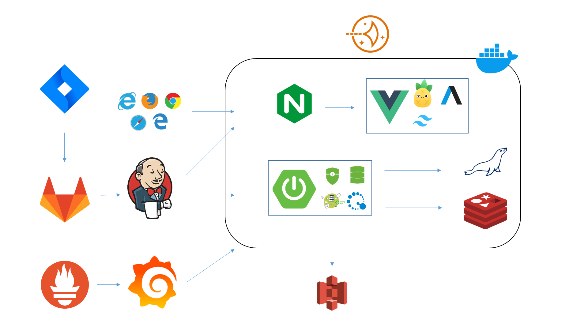
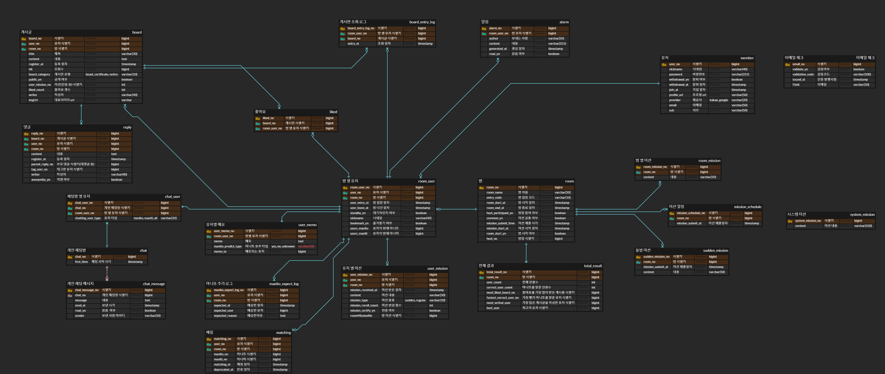
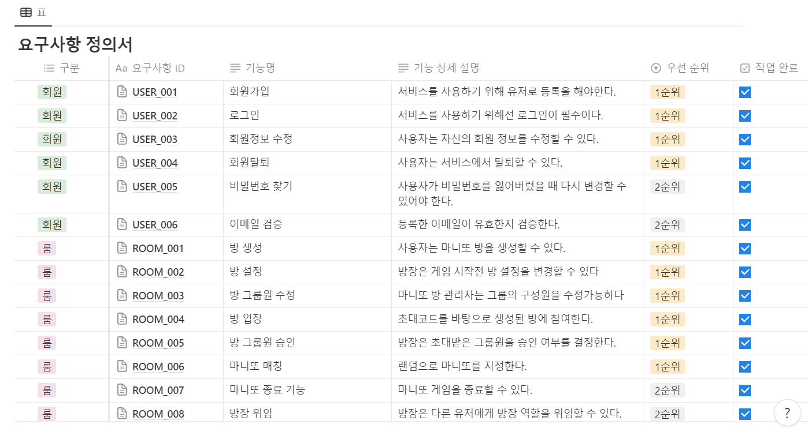

<div align="center">

</div>
<br/>

## Secreto?
**Secreto**는 **온라인 마니또 서비스**입니다. 오프라인에서 즐기던 마니또 활동을 온라인으로까지 확대하였습니다. 익명 채팅, 다양한 미션, 활동 기록 등 즐거운 서비스를 도입하였고 반응형 웹 디자인으로 모바일, 태블릿, PC 어떤 기기에서도 이용할 수 있습니다. 이제 Secreto로 언제 어디서든 마니또 활동을 즐겨보세요!

<h5>방 생성 화면</h5>

 <br/>

<h5>채팅 화면</h5>
 <br/>

<h5>히스토리 화면</h5>
 <br/>

## 📃 Description
> <h3><font color="green">서비스 주요 기능</font></h3>
<ul>
	<li>매칭  기능 : 마니또를 매칭하는 기능</li>
	<li>마니또 그룹 관리 : 방장이 게임할 인원들을 모집하게 게임을 관리하는 기능</li>
	<li>미션 관리 기능 : 미션을 지정하거나 원하는 미션을 생성할 수 있는 기능</li>
	<li>채팅 기능: 마니또와 미니띠가 익명으로 채팅을 사용할 수 있는 기능</li>
	<li>요약 기능: 마니또가 수혜 받은 기록 등을 히스토리를 통해서 한번에 볼 수 있도록 하는 기능</li>
	<li>게시판 기능: 자유롭게 마니또를 칭찬할 수 있는 게시물 작성 가능</li>
	<li>마니또 유추 기능 : 마니또가 누구인지 확인해볼 수 있는 기능</li>
</ul>
<br/>
<br/>

> <h3><font color="green">기술 특이점</font></h3>
<ul>
	<li>1. Atomic Design을 활용하여 재사용성이 높은 프론트엔드 개발</li>
	<li>2. OAuth, Open Connect ID를 활용하여 로그인 소셜 구현</li>
	<li>3. SSE를 활용하여 실시간 알람 서비스 구축</li>
	<li>4. 스케줄러를 활용하여 주기적으로 미션 이벤트 발생</li>
	<li>5. S3를 활용하여 파일 업로드 구현</li>
	<li>6. STOMP와 WebSocket을 활용한 채팅 구현</li>
	<li>7. 백엔드, 프론트엔드 https 인증</li>
	<li>8. Prometheus와 Grapana를 활용한 모니터링 구축</li>
</ul>
<br/>
<br/>

## 📝 Design
> <h3><font color="green">전체 기술 스택</font></h3>

>  <br/>

> <h3><font color="green">전체 시스템 구조</font></h3>

>  <br/>

> <h3><font color="green">ERD 다이어그램</font></h3>

>  > [링크](https://www.erdcloud.com/d/CxFthe8tLGuDJf3Bz) 바로가기
> <br/>

> <h3><font color="green">요구사항 정의서</font></h3>

>  <br/>

> <br/>
> <br/>

> <h3><font color="green">API 명세서</font></h3>

>  <br/>


## 💻Front-End

### 1. 개발 환경(IDE)

- 프로젝트 설정 CLI
    
    ```bash
    # git bash
    npm init vue@latest
    Project name : secreto
    Add TypeScrfipt? Yes
    Add JSX Support? Yes
    Add vue Router for SPA Development? Yes
    Add Pinia for state management? Yes
    Add Vitest for Unit Testing? option
    Add ESLint for code quality? Yes
    Add Prettier for code formatting? Yes
    
    # 프로젝트 VSC 열고 디펜던시 설치 및 실행하기 
    code .
    npm install
    npm run dev
    ```
    
- VisualStudioCode(VSC)
    - 1.85.1
    - Extensions
        - Auto Rename Tag
        - ESLint
        - Prettier - Code formatter
        - Git Lens
        - TODO Highlight
        - Material icon Theme
        - Tailwind CSS Intellisense
        - TypeScript Vue Plugin (Volar)
        - Vue3 Snippets
- Node.js
    - 20.11.0 LTS
- NPM
    - 10.3.0
- tailwind
    - 테일 윈드 설치 방법
        
        ```
        npm install -D tailwindcss postcss autoprefixer
        
        npx tailwindcss init -p
        ```
        
    - 3.4.1

### 2. 개발 언어 및 프레임 워크

- vue
    - 3.3.11
- @vue/cli
    - 5.0.8
- TypeScript
    - 5.3.3

### 3. 기타 라이브러리

- pinia (데이터 전역관리)
    - 2.1.7
- pinia-plugin-persistedstate (새로 고침시 피니아 데이터 초기화 문제 방지)
    - 3.2.1
- axios (api 통신)
    - 1.6.5
- ant-design-vue (아이콘, 이벤트 등)
    - 4.1.2
- quill-image-uploader (quill editor 이미지 S3 업로드 용)
    - 1.3.0
- @vueup/vue-quill (텍스트 에디터)
    - 1.2.0
- stompjs (소켓 연결용)
    - 2.3.3
- sockjs-client (소켓 연결용)
    - 1.6.1
- vuewordcloud (실시간 워드크라우드)
    - 19.0.0

### 4. 빌드 및 배포 도구

- Vite
- NginX
<br/>


## 💻Back-End

### 1. 개발 환경(IDE)

- IntelliJ
    
    

### 2. 개발 언어 및 프레임워크, 라이브러리

- Java 17.0.10 2024-01-16 LTS
- Spring Boot
    - MVC Spring Boot Web boot-starter 3.2.2
    - JPA
        - Spring Data JPA 3.2.2
        - QueryDSL 5.0.0
    - WebSocket 6.1.3
    - Scheduler
    - SSE
    - Spring Security 6.2.1
        - OAuth2 Client 6.2.1
    - Validation 3.0.2
    - Java Mail Sender 2.0.2
- io.jsonwebtoken:jjwt  0.11.5
- Lombok 1.18.30
- p6spy-spring-boot-starter 1..9.0
- spring-cloud-aws-s3 3.0.2

### 3. 데이터베이스

- Redis 7.2.4
- MariaDB 11.2.3

### 4. 테스팅 도구

- JUnit  5.10.1
    - AssertJ 3.24.2
- Mockito 5.7.0

### 5. 빌드 및 배포 도구

- Gradle
- Docker 25.0.0
- NginX 1.18.0
- Jenkins 2.441
- AWS Lightsail / S3
- Prometheus 2.50
- Grafana 10.3.1
- Node Exporter 1.7.0

### 6. 형상관리 도구

- GitLab
- Jira                                                                    |

<br/>


## 👨‍👦‍👦 Team Member
> <h3><font color="red">Front-End</font></h3>
<table>
 <tr>
    <td align="center"><a href="https://github.com/JIINSUNG"></a></td>
    <td align="center"><a href="https://github.com/tooyul"></a></td>
    <td align="center"><a href="https://github.com/h-spear"></a></td>
  </tr>
  <tr>
    <td align="center"><a href="https://github.com/JIINSUNG"><b>지인성</b></a></td>
    <td align="center"><a href="https://github.com/tooyul"><b>신시원</b></a></td>
    <td align="center"><a href="https://github.com/h-spear"><b>김현창</b></a></td>
  </tr>
  <tr>
    <td align="center">프론트엔드</td>
    <td align="center">프론트엔드</td>
    <td align="center">프론트엔드</td>
  </tr>
</table>

> <h3><font color="red">Back-End</font></h3>
<table>
 <tr>
    <td align="center"><a href="https://github.com/yee950419"></a></td>
    <td align="center"><a href="https://github.com/KrswJo"></a></td>
    <td align="center"><a href="https://github.com/namoo1818"></a></td>
  </tr>
  <tr>
    <td align="center"><a href="https://github.com/yee950419"><b>이상학</b></a></td>
    <td align="center"><a href="https://github.com/KrswJo"><b>조승우</b></a></td>
    <td align="center"><a href="https://github.com/namoo1818"><b>이민지</b></a></td>
  </tr>
  <tr>
    <td align="center">팀장, 백엔드</td>
    <td align="center">백엔드</td>
    <td align="center">백엔드</td>
  </tr>
</table>

## 🏷 License
<p>
This software is licensed under the MIT <a href="https://www.ssafy.com/ksp/jsp/swp/swpMain.jsp" _blank="new">©SSAFY</a>.
</p>

