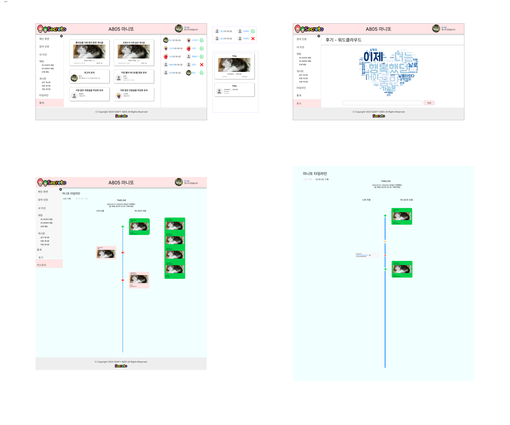
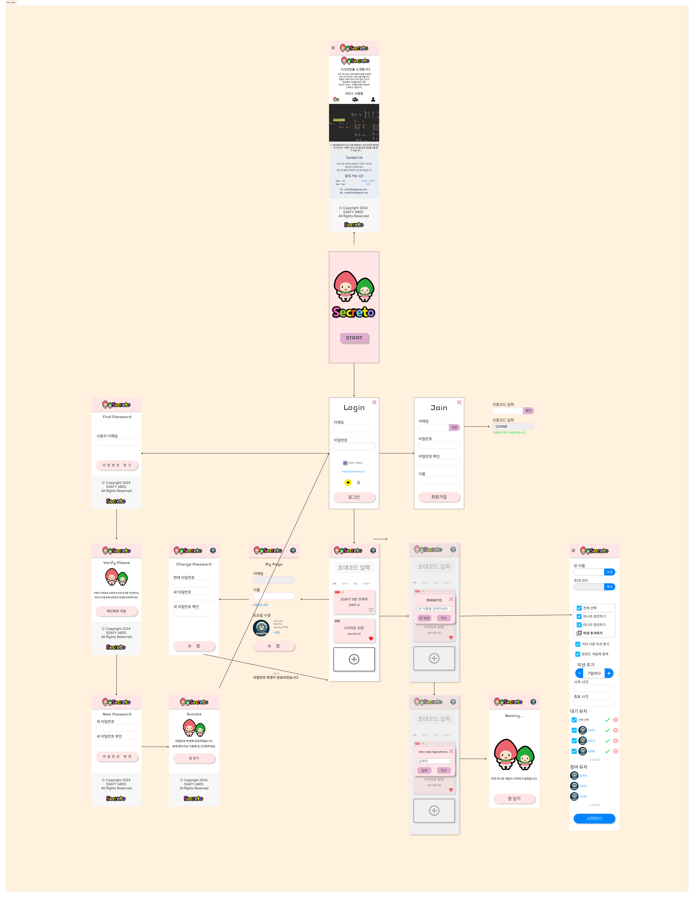
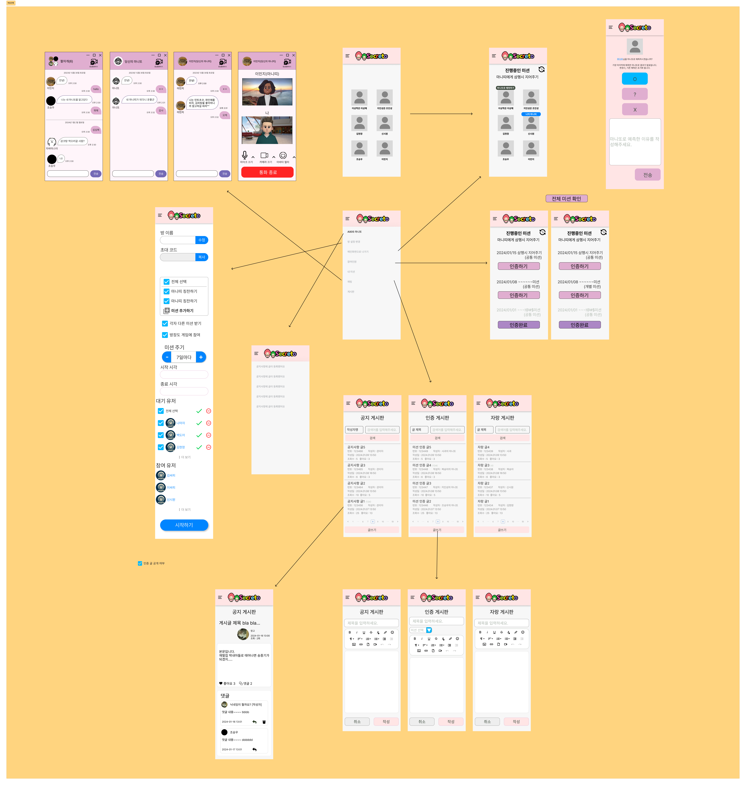
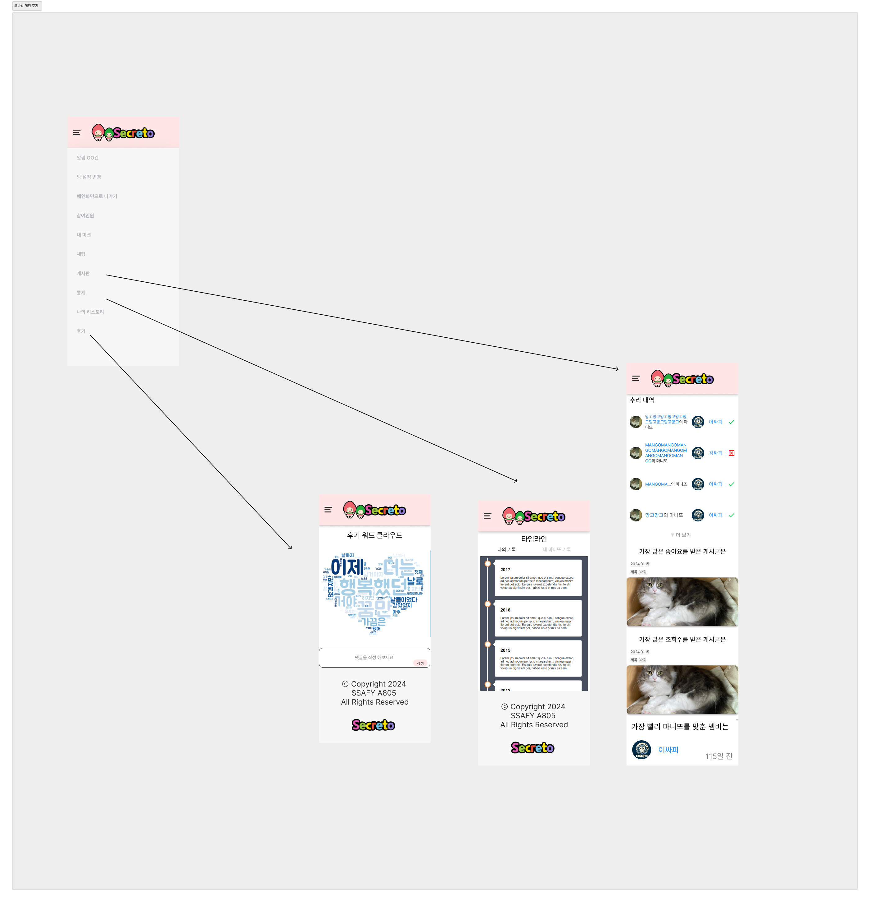

<div align="center">

</div>
<br/>

## Secreto?
**Secreto**는 **온라인 마니또 서비스**입니다. 오프라인에서 즐기던 마니또 활동을 온라인으로까지 확대하였습니다. 익명 채팅, 다양한 미션, 활동 기록 등 즐거운 서비스를 도입하였고 반응형 웹 디자인으로 모바일, 태블릿, PC 어떤 기기에서도 이용할 수 있습니다. 이제 Secreto로 언제 어디서든 마니또 활동을 즐겨보세요!

<h5>방 생성 화면</h5>
 <br/>

<h5>채팅 화면</h5>
 <br/>

<h5>히스토리 화면</h5>
 <br/>

## 📃 Description
> <h3><font color="green">서비스 주요 기능</font></h3>
<ul>
	<li>매칭  기능 : 마니또를 매칭하는 기능</li>
	<li>마니또 그룹 관리 : 방장이 게임할 인원들을 모집하게 게임을 관리하는 기능</li>
	<li>미션 관리 기능 : 미션을 지정하거나 원하는 미션을 생성할 수 있는 기능</li>
	<li>채팅 기능: 마니또와 미니띠가 익명으로 채팅을 사용할 수 있는 기능</li>
	<li>요약 기능: 마니또가 수혜 받은 기록 등을 히스토리를 통해서 한번에 볼 수 있도록 하는 기능</li>
	<li>게시판 기능: 자유롭게 마니또를 칭찬할 수 있는 게시물 작성 가능</li>
	<li>마니또 유추 기능 : 마니또가 누구인지 확인해볼 수 있는 기능</li>
</ul>
<br/>
<br/>

> <h3><font color="green">기술 특이점</font></h3>
<ul>
	<li>1. Atomic Design을 활용하여 재사용성이 높은 프론트엔드 개발</li>
	<li>2. OAuth, Open Connect ID를 활용하여 로그인 소셜 구현</li>
	<li>3. SSE를 활용하여 실시간 알람 서비스 구축</li>
	<li>4. 스케줄러를 활용하여 주기적으로 미션 이벤트 발생</li>
	<li>5. S3를 활용하여 파일 업로드 구현</li>
	<li>6. STOMP와 WebSocket을 활용한 채팅 구현</li>
	<li>7. 백엔드, 프론트엔드 https 인증</li>
	<li>8. Prometheus와 Grapana를 활용한 모니터링 구축</li>
</ul>
<br/>
<br/>

## 📝 Design
> <h3><font color="green">전체 기술 스택</font></h3>

>  <br/>

> <h3><font color="green">전체 시스템 구조</font></h3>

>  <br/>

> <h3><font color="green">ERD 다이어그램</font></h3>

>  > [링크](https://www.erdcloud.com/d/CxFthe8tLGuDJf3Bz) 바로가기
> <br/>

> <h3><font color="green">요구사항 정의서</font></h3>

>  <br/>

> <br/>
> <br/>

> <h3><font color="green">API 명세서</font></h3>

>  <br/>

> <br/>
> <br/>

> <h3><font color="green">화면 명세서</font></h3>

> <h4>서비스 온보딩</h4>
>  <br/>

> <h4>게임 진행</h4>
>  <br/>

> <h4>게임 후기</h4>
>  <br/>

> <h4>모바일 서비스 온보딩</h4>
>  <br/>

> <h4>모바일 게임 진행</h4>
>  <br/>

> <h4>모바일 게임 후기</h4>
>  <br/>

> <br/>
> <br/>


## 💻Front-End

### 1. 개발 환경(IDE)

- 프로젝트 설정 CLI
    
    ```bash
    # git bash
    npm init vue@latest
    Project name : secreto
    Add TypeScrfipt? Yes
    Add JSX Support? Yes
    Add vue Router for SPA Development? Yes
    Add Pinia for state management? Yes
    Add Vitest for Unit Testing? option
    Add ESLint for code quality? Yes
    Add Prettier for code formatting? Yes
    
    # 프로젝트 VSC 열고 디펜던시 설치 및 실행하기 
    code .
    npm install
    npm run dev
    ```
    
- VisualStudioCode(VSC)
    - 1.85.1
    - Extensions
        - Auto Rename Tag
        - ESLint
        - Prettier - Code formatter
        - Git Lens
        - TODO Highlight
        - Material icon Theme
        - Tailwind CSS Intellisense
        - TypeScript Vue Plugin (Volar)
        - Vue3 Snippets
- Node.js
    - 20.11.0 LTS
- NPM
    - 10.3.0
- tailwind
    - 테일 윈드 설치 방법
        
        ```
        npm install -D tailwindcss postcss autoprefixer
        
        npx tailwindcss init -p
        ```
        
    - 3.4.1

### 2. 개발 언어 및 프레임 워크

- vue
    - 3.3.11
- @vue/cli
    - 5.0.8
- TypeScript
    - 5.3.3

### 3. 기타 라이브러리

- pinia (데이터 전역관리)
    - 2.1.7
- pinia-plugin-persistedstate (새로 고침시 피니아 데이터 초기화 문제 방지)
    - 3.2.1
- axios (api 통신)
    - 1.6.5
- ant-design-vue (아이콘, 이벤트 등)
    - 4.1.2
- quill-image-uploader (quill editor 이미지 S3 업로드 용)
    - 1.3.0
- @vueup/vue-quill (텍스트 에디터)
    - 1.2.0
- stompjs (소켓 연결용)
    - 2.3.3
- sockjs-client (소켓 연결용)
    - 1.6.1
- vuewordcloud (실시간 워드크라우드)
    - 19.0.0

### 4. 빌드 및 배포 도구

- Vite
- NginX
<br/>

> <h3><font color="green">디렉토리 구조</font></h3>

```markdown
📦frontend
 ┣ 📂public
 ┃ ┗ 📜character.png
 ┣ 📂src
 ┃ ┣ 📂api
 ┃ ┃ ┣ 📜board.ts
 ┃ ┃ ┣ 📜chatting.ts
 ┃ ┃ ┣ 📜history.ts
 ┃ ┃ ┣ 📜mission.ts
 ┃ ┃ ┣ 📜notification.ts
 ┃ ┃ ┣ 📜room.ts
 ┃ ┃ ┣ 📜sse.ts
 ┃ ┃ ┣ 📜upload.ts
 ┃ ┃ ┗ 📜user.ts
 ┃ ┣ 📂assets
 ┃ ┃ ┣ 📂images
 ┃ ┃ ┃ ┣ 📂button
 ┃ ┃ ┃ ┃ ┣ 📜login-google.png
 ┃ ┃ ┃ ┃ ┗ 📜login-kakao.png
 ┃ ┃ ┃ ┣ 📂guides
 ┃ ┃ ┃ ┃ ┣ 📜master1.png
 ┃ ┃ ┃ ┃ ┣ 📜master2.png
 ┃ ┃ ┃ ┃ ┣ 📜master3.png
 ┃ ┃ ┃ ┃ ┣ 📜master4.png
 ┃ ┃ ┃ ┃ ┣ 📜master5.png
 ┃ ┃ ┃ ┃ ┣ 📜master6.png
 ┃ ┃ ┃ ┃ ┣ 📜master7.png
 ┃ ┃ ┃ ┃ ┣ 📜master8.png
 ┃ ┃ ┃ ┃ ┣ 📜user1.png
 ┃ ┃ ┃ ┃ ┣ 📜user10.png
 ┃ ┃ ┃ ┃ ┣ 📜user11.png
 ┃ ┃ ┃ ┃ ┣ 📜user12.png
 ┃ ┃ ┃ ┃ ┣ 📜user13.png
 ┃ ┃ ┃ ┃ ┣ 📜user14.png
 ┃ ┃ ┃ ┃ ┣ 📜user2.png
 ┃ ┃ ┃ ┃ ┣ 📜user3.png
 ┃ ┃ ┃ ┃ ┣ 📜user4.png
 ┃ ┃ ┃ ┃ ┣ 📜user5.png
 ┃ ┃ ┃ ┃ ┣ 📜user6.png
 ┃ ┃ ┃ ┃ ┣ 📜user7.png
 ┃ ┃ ┃ ┃ ┣ 📜user8.png
 ┃ ┃ ┃ ┃ ┗ 📜user9.png
 ┃ ┃ ┃ ┣ 📂member
 ┃ ┃ ┃ ┃ ┣ 📜member1.png
 ┃ ┃ ┃ ┃ ┣ 📜member2.png
 ┃ ┃ ┃ ┃ ┣ 📜member3.png
 ┃ ┃ ┃ ┃ ┣ 📜member4.jpg
 ┃ ┃ ┃ ┃ ┣ 📜member5.jpg
 ┃ ┃ ┃ ┃ ┗ 📜member6.png
 ┃ ┃ ┃ ┣ 📜character.png
 ┃ ┃ ┃ ┣ 📜character2.png
 ┃ ┃ ┃ ┣ 📜default-avatar.png
 ┃ ┃ ┃ ┣ 📜logo.png
 ┃ ┃ ┃ ┗ 📜manito-avatar.png
 ┃ ┃ ┗ 📜main.css
 ┃ ┣ 📂components
 ┃ ┃ ┣ 📂atoms
 ┃ ┃ ┃ ┣ 📜AvatarAtom.vue
 ┃ ┃ ┃ ┣ 📜BadgeAtom.vue
 ┃ ┃ ┃ ┣ 📜ButtonAtom.vue
 ┃ ┃ ┃ ┣ 📜CharacterAtom.vue
 ┃ ┃ ┃ ┣ 📜CloseButtonAtom.vue
 ┃ ┃ ┃ ┣ 📜InputImageAtom.vue
 ┃ ┃ ┃ ┣ 📜LineAtom.vue
 ┃ ┃ ┃ ┣ 📜LogoAtom.vue
 ┃ ┃ ┃ ┗ 📜TextAtom.vue
 ┃ ┃ ┣ 📂molecules
 ┃ ┃ ┃ ┣ 📂board
 ┃ ┃ ┃ ┃ ┣ 📜BoardDetailBottom.vue
 ┃ ┃ ┃ ┃ ┣ 📜BoardDetailTop.vue
 ┃ ┃ ┃ ┃ ┣ 📜BoardElement.vue
 ┃ ┃ ┃ ┃ ┣ 📜BoardHeader.vue
 ┃ ┃ ┃ ┃ ┣ 📜BoardTableHeader.vue
 ┃ ┃ ┃ ┃ ┣ 📜BoardWriterInformation.vue
 ┃ ┃ ┃ ┃ ┣ 📜LikeButton.vue
 ┃ ┃ ┃ ┃ ┣ 📜MobileBoardElement.vue
 ┃ ┃ ┃ ┃ ┣ 📜NestedReplyWriteForm.vue
 ┃ ┃ ┃ ┃ ┣ 📜ReplyModifyForm.vue
 ┃ ┃ ┃ ┃ ┗ 📜ReplyWriteForm.vue
 ┃ ┃ ┃ ┣ 📂common
 ┃ ┃ ┃ ┃ ┣ 📜ButtonInputBox.vue
 ┃ ┃ ┃ ┃ ┣ 📜CheckBox.vue
 ┃ ┃ ┃ ┃ ┣ 📜DateButton.vue
 ┃ ┃ ┃ ┃ ┣ 📜HeaderLogo.vue
 ┃ ┃ ┃ ┃ ┣ 📜HeaderProfile.vue
 ┃ ┃ ┃ ┃ ┣ 📜InputBox.vue
 ┃ ┃ ┃ ┃ ┣ 📜MainLogo.vue
 ┃ ┃ ┃ ┃ ┣ 📜MenuItem.vue
 ┃ ┃ ┃ ┃ ┗ 📜SelectBox.vue
 ┃ ┃ ┃ ┣ 📂game
 ┃ ┃ ┃ ┃ ┣ 📜ChatProfile.vue
 ┃ ┃ ┃ ┃ ┣ 📜ExpectedMission.vue
 ┃ ┃ ┃ ┃ ┣ 📜ManitoResultElement.vue
 ┃ ┃ ┃ ┃ ┣ 📜MissionCard.vue
 ┃ ┃ ┃ ┃ ┣ 📜PaticipateProfile.vue
 ┃ ┃ ┃ ┃ ┣ 📜ProfileInfo.vue
 ┃ ┃ ┃ ┃ ┣ 📜StatisticCard.vue
 ┃ ┃ ┃ ┃ ┗ 📜StatisticLargeCard.vue
 ┃ ┃ ┃ ┗ 📂main
 ┃ ┃ ┃ ┃ ┣ 📜MainCardProfile.vue
 ┃ ┃ ┃ ┃ ┣ 📜MobileInvitationCodeBox.vue
 ┃ ┃ ┃ ┃ ┣ 📜MobileMiniHeader.vue
 ┃ ┃ ┃ ┃ ┣ 📜RoomCard.vue
 ┃ ┃ ┃ ┃ ┣ 📜RoomCreateCard.vue
 ┃ ┃ ┃ ┃ ┗ 📜ServiceFeature.vue
 ┃ ┃ ┣ 📂organisms
 ┃ ┃ ┃ ┣ 📂board
 ┃ ┃ ┃ ┃ ┣ 📜BoardSearchBox.vue
 ┃ ┃ ┃ ┃ ┗ 📜ReplyElement.vue
 ┃ ┃ ┃ ┣ 📂common
 ┃ ┃ ┃ ┃ ┣ 📜ContactSection.vue
 ┃ ┃ ┃ ┃ ┣ 📜FooterBar.vue
 ┃ ┃ ┃ ┃ ┣ 📜HeaderBar.vue
 ┃ ┃ ┃ ┃ ┣ 📜NavBar.vue
 ┃ ┃ ┃ ┃ ┗ 📜ServiceGuide.vue
 ┃ ┃ ┃ ┣ 📂game
 ┃ ┃ ┃ ┃ ┣ 📜ApprovedUserList.vue
 ┃ ┃ ┃ ┃ ┣ 📜ChatRoom.vue
 ┃ ┃ ┃ ┃ ┣ 📜ExpectedMissionList.vue
 ┃ ┃ ┃ ┃ ┣ 📜GameHeader.vue
 ┃ ┃ ┃ ┃ ┣ 📜HistoryCard.vue
 ┃ ┃ ┃ ┃ ┣ 📜MissionHeader.vue
 ┃ ┃ ┃ ┃ ┣ 📜MissionList.vue
 ┃ ┃ ┃ ┃ ┣ 📜PredictCard.vue
 ┃ ┃ ┃ ┃ ┣ 📜UnapprovedUserList.vue
 ┃ ┃ ┃ ┃ ┗ 📜UnexpectedMission.vue
 ┃ ┃ ┃ ┣ 📂main
 ┃ ┃ ┃ ┃ ┣ 📜ChangePasswordForm.vue
 ┃ ┃ ┃ ┃ ┣ 📜FindPasswordForm.vue
 ┃ ┃ ┃ ┃ ┣ 📜JoinForm.vue
 ┃ ┃ ┃ ┃ ┣ 📜LoginForm.vue
 ┃ ┃ ┃ ┃ ┣ 📜MainCard.vue
 ┃ ┃ ┃ ┃ ┣ 📜MyPage.vue
 ┃ ┃ ┃ ┃ ┣ 📜ResetPasswordForm.vue
 ┃ ┃ ┃ ┃ ┗ 📜RoomListView.vue
 ┃ ┃ ┃ ┗ 📂modal
 ┃ ┃ ┃ ┃ ┣ 📜AccountDeleteModalContent1.vue
 ┃ ┃ ┃ ┃ ┣ 📜AccountDeleteModalContent2.vue
 ┃ ┃ ┃ ┃ ┣ 📜AccountDeleteModalContent3.vue
 ┃ ┃ ┃ ┃ ┣ 📜InferenceModalContent.vue
 ┃ ┃ ┃ ┃ ┣ 📜IntrudingModalContent.vue
 ┃ ┃ ┃ ┃ ┣ 📜RoomCreateModalContent.vue
 ┃ ┃ ┃ ┃ ┣ 📜RoomDeleteModalContent.vue
 ┃ ┃ ┃ ┃ ┣ 📜RoomEnterModalContent.vue
 ┃ ┃ ┃ ┃ ┣ 📜RoomMissionModalContent.vue
 ┃ ┃ ┃ ┃ ┣ 📜YesModalContent.vue
 ┃ ┃ ┃ ┃ ┗ 📜YesNoModalContent.vue
 ┃ ┃ ┣ 📂pages
 ┃ ┃ ┃ ┣ 📂board
 ┃ ┃ ┃ ┃ ┣ 📜BoardDetailPage.vue
 ┃ ┃ ┃ ┃ ┣ 📜BoardListPage.vue
 ┃ ┃ ┃ ┃ ┣ 📜BoardModifyPage.vue
 ┃ ┃ ┃ ┃ ┣ 📜BoardPage.vue
 ┃ ┃ ┃ ┃ ┗ 📜BoardWritePage.vue
 ┃ ┃ ┃ ┣ 📜EntranceWaitingPage.vue
 ┃ ┃ ┃ ┣ 📜LoginView.vue
 ┃ ┃ ┃ ┣ 📜MainView.vue
 ┃ ┃ ┃ ┣ 📜NotificationPage.vue
 ┃ ┃ ┃ ┣ 📜ParticipatePage.vue
 ┃ ┃ ┃ ┣ 📜ResetPasswordPage.vue
 ┃ ┃ ┃ ┣ 📜ReviewPage.vue
 ┃ ┃ ┃ ┣ 📜RoomPage.vue
 ┃ ┃ ┃ ┣ 📜RoomSetting.vue
 ┃ ┃ ┃ ┣ 📜ServiceView.vue
 ┃ ┃ ┃ ┣ 📜sswTest.vue
 ┃ ┃ ┃ ┣ 📜StatisticPage.vue
 ┃ ┃ ┃ ┣ 📜TimeLinePage.vue
 ┃ ┃ ┃ ┣ 📜UserMission.vue
 ┃ ┃ ┃ ┗ 📜WithdrawalSuccessPage.vue
 ┃ ┃ ┗ 📂template
 ┃ ┃ ┃ ┣ 📜ModalTemplate.vue
 ┃ ┃ ┃ ┣ 📜RedirectTemplate.vue
 ┃ ┃ ┃ ┗ 📜WideCardTemplate.vue
 ┃ ┣ 📂router
 ┃ ┃ ┗ 📜index.ts
 ┃ ┣ 📂stores
 ┃ ┃ ┣ 📜menu.ts
 ┃ ┃ ┗ 📜user.ts
 ┃ ┣ 📂types
 ┃ ┃ ┣ 📜board.ts
 ┃ ┃ ┣ 📜chat.ts
 ┃ ┃ ┣ 📜common.ts
 ┃ ┃ ┣ 📜history.ts
 ┃ ┃ ┣ 📜mission.ts
 ┃ ┃ ┣ 📜notify.ts
 ┃ ┃ ┣ 📜room.ts
 ┃ ┃ ┗ 📜user.ts
 ┃ ┣ 📂utils
 ┃ ┃ ┣ 📜date.ts
 ┃ ┃ ┣ 📜editor.ts
 ┃ ┃ ┣ 📜http-commons.ts
 ┃ ┃ ┣ 📜http-status.ts
 ┃ ┃ ┗ 📜upload.ts
 ┃ ┣ 📜App.vue
 ┃ ┗ 📜main.ts
 ┣ 📜.env
 ┣ 📜.prettierrc.json
 ┣ 📜env.d.ts
 ┣ 📜index.html
 ┣ 📜package-lock.json
 ┣ 📜package.json
 ┣ 📜tailwind.config.js
 ┣ 📜tsconfig.app.json
 ┣ 📜tsconfig.json
 ┣ 📜tsconfig.node.json
 ┣ 📜vite.config.ts
 ┗ 📜yarn.lock
```

<br/>

## 💻Back-End

### 1. 개발 환경(IDE)

- IntelliJ
    
    

### 2. 개발 언어 및 프레임워크, 라이브러리

- Java 17.0.10 2024-01-16 LTS
- Spring Boot
    - MVC Spring Boot Web boot-starter 3.2.2
    - JPA
        - Spring Data JPA 3.2.2
        - QueryDSL 5.0.0
    - WebSocket 6.1.3
    - Scheduler
    - SSE
    - Spring Security 6.2.1
        - OAuth2 Client 6.2.1
    - Validation 3.0.2
    - Java Mail Sender 2.0.2
- io.jsonwebtoken:jjwt  0.11.5
- Lombok 1.18.30
- p6spy-spring-boot-starter 1..9.0
- spring-cloud-aws-s3 3.0.2

### 3. 데이터베이스

- Redis 7.2.4
- MariaDB 11.2.3

### 4. 테스팅 도구

- JUnit  5.10.1
    - AssertJ 3.24.2
- Mockito 5.7.0

### 5. 빌드 및 배포 도구

- Gradle
- Docker 25.0.0
- NginX 1.18.0
- Jenkins 2.441
- AWS Lightsail / S3
- Prometheus 2.50
- Grafana 10.3.1
- Node Exporter 1.7.0

### 6. 형상관리 도구

- GitLab
- Jira                                                                    |

<br/>

> <h3><font color="green">디렉토리 구조</font></h3>

```markdown
📦backend
 ┣ 📂gradle
 ┃ ┗ 📂wrapper
 ┃ ┃ ┣ 📜gradle-wrapper.jar
 ┃ ┃ ┗ 📜gradle-wrapper.properties
 ┣ 📂src
 ┃ ┗ 📂main
 ┃ ┃ ┣ 📂java
 ┃ ┃ ┃ ┗ 📂com
 ┃ ┃ ┃ ┃ ┗ 📂pjg
 ┃ ┃ ┃ ┃ ┃ ┗ 📂secreto
 ┃ ┃ ┃ ┃ ┃ ┃ ┣ 📂alarm
 ┃ ┃ ┃ ┃ ┃ ┃ ┃ ┣ 📂common
 ┃ ┃ ┃ ┃ ┃ ┃ ┃ ┃ ┣ 📂entity
 ┃ ┃ ┃ ┃ ┃ ┃ ┃ ┃ ┃ ┗ 📜Alarm.java
 ┃ ┃ ┃ ┃ ┃ ┃ ┃ ┃ ┗ 📂exception
 ┃ ┃ ┃ ┃ ┃ ┃ ┃ ┃ ┃ ┗ 📜AlarmException.java
 ┃ ┃ ┃ ┃ ┃ ┃ ┃ ┣ 📂controller
 ┃ ┃ ┃ ┃ ┃ ┃ ┃ ┃ ┗ 📜AlarmController.java
 ┃ ┃ ┃ ┃ ┃ ┃ ┃ ┣ 📂dto
 ┃ ┃ ┃ ┃ ┃ ┃ ┃ ┃ ┣ 📜AlarmDataDto.java
 ┃ ┃ ┃ ┃ ┃ ┃ ┃ ┃ ┣ 📜BoardAlarmDataDto.java
 ┃ ┃ ┃ ┃ ┃ ┃ ┃ ┃ ┣ 📜DataDto.java
 ┃ ┃ ┃ ┃ ┃ ┃ ┃ ┃ ┗ 📜ShowAlarmDto.java
 ┃ ┃ ┃ ┃ ┃ ┃ ┃ ┣ 📂repository
 ┃ ┃ ┃ ┃ ┃ ┃ ┃ ┃ ┣ 📜AlarmRepository.java
 ┃ ┃ ┃ ┃ ┃ ┃ ┃ ┃ ┗ 📜EmitterRepository.java
 ┃ ┃ ┃ ┃ ┃ ┃ ┃ ┗ 📂service
 ┃ ┃ ┃ ┃ ┃ ┃ ┃ ┃ ┣ 📜AlarmService.java
 ┃ ┃ ┃ ┃ ┃ ┃ ┃ ┃ ┗ 📜EmitterService.java
 ┃ ┃ ┃ ┃ ┃ ┃ ┣ 📂board
 ┃ ┃ ┃ ┃ ┃ ┃ ┃ ┣ 📂command
 ┃ ┃ ┃ ┃ ┃ ┃ ┃ ┃ ┣ 📂controller
 ┃ ┃ ┃ ┃ ┃ ┃ ┃ ┃ ┃ ┗ 📜BoardCommandController.java
 ┃ ┃ ┃ ┃ ┃ ┃ ┃ ┃ ┣ 📂dto
 ┃ ┃ ┃ ┃ ┃ ┃ ┃ ┃ ┃ ┣ 📜UpdateBoardRequestDto.java
 ┃ ┃ ┃ ┃ ┃ ┃ ┃ ┃ ┃ ┣ 📜UpdateReplyRequestDto.java
 ┃ ┃ ┃ ┃ ┃ ┃ ┃ ┃ ┃ ┣ 📜WriteBoardRequestDto.java
 ┃ ┃ ┃ ┃ ┃ ┃ ┃ ┃ ┃ ┗ 📜WriteReplyRequestDto.java
 ┃ ┃ ┃ ┃ ┃ ┃ ┃ ┃ ┣ 📂repository
 ┃ ┃ ┃ ┃ ┃ ┃ ┃ ┃ ┃ ┣ 📜BoardCommandRepository.java
 ┃ ┃ ┃ ┃ ┃ ┃ ┃ ┃ ┃ ┣ 📜BoardEntryLogCommandRepository.java
 ┃ ┃ ┃ ┃ ┃ ┃ ┃ ┃ ┃ ┣ 📜LikedCommandRepository.java
 ┃ ┃ ┃ ┃ ┃ ┃ ┃ ┃ ┃ ┗ 📜ReplyCommandRepository.java
 ┃ ┃ ┃ ┃ ┃ ┃ ┃ ┃ ┗ 📂service
 ┃ ┃ ┃ ┃ ┃ ┃ ┃ ┃ ┃ ┣ 📜BoardCommandService.java
 ┃ ┃ ┃ ┃ ┃ ┃ ┃ ┃ ┃ ┗ 📜BoardCommandServiceImpl.java
 ┃ ┃ ┃ ┃ ┃ ┃ ┃ ┣ 📂common
 ┃ ┃ ┃ ┃ ┃ ┃ ┃ ┃ ┣ 📂entity
 ┃ ┃ ┃ ┃ ┃ ┃ ┃ ┃ ┃ ┣ 📜Board.java
 ┃ ┃ ┃ ┃ ┃ ┃ ┃ ┃ ┃ ┣ 📜BoardCategory.java
 ┃ ┃ ┃ ┃ ┃ ┃ ┃ ┃ ┃ ┣ 📜BoardEntryLog.java
 ┃ ┃ ┃ ┃ ┃ ┃ ┃ ┃ ┃ ┣ 📜Liked.java
 ┃ ┃ ┃ ┃ ┃ ┃ ┃ ┃ ┃ ┗ 📜Reply.java
 ┃ ┃ ┃ ┃ ┃ ┃ ┃ ┃ ┗ 📂exception
 ┃ ┃ ┃ ┃ ┃ ┃ ┃ ┃ ┃ ┗ 📜BoardException.java
 ┃ ┃ ┃ ┃ ┃ ┃ ┃ ┗ 📂query
 ┃ ┃ ┃ ┃ ┃ ┃ ┃ ┃ ┣ 📂controller
 ┃ ┃ ┃ ┃ ┃ ┃ ┃ ┃ ┃ ┗ 📜BoardQueryController.java
 ┃ ┃ ┃ ┃ ┃ ┃ ┃ ┃ ┣ 📂dto
 ┃ ┃ ┃ ┃ ┃ ┃ ┃ ┃ ┃ ┣ 📜SearchBoardRequestDto.java
 ┃ ┃ ┃ ┃ ┃ ┃ ┃ ┃ ┃ ┣ 📜SearchBoardResponseDto.java
 ┃ ┃ ┃ ┃ ┃ ┃ ┃ ┃ ┃ ┣ 📜SearchPostResponseDto.java
 ┃ ┃ ┃ ┃ ┃ ┃ ┃ ┃ ┃ ┗ 📜SearchReplyResponseDto.java
 ┃ ┃ ┃ ┃ ┃ ┃ ┃ ┃ ┣ 📂repository
 ┃ ┃ ┃ ┃ ┃ ┃ ┃ ┃ ┃ ┣ 📜BoardEntryLogQueryRepository.java
 ┃ ┃ ┃ ┃ ┃ ┃ ┃ ┃ ┃ ┣ 📜BoardQueryRepository.java
 ┃ ┃ ┃ ┃ ┃ ┃ ┃ ┃ ┃ ┣ 📜LikedQueryRepository.java
 ┃ ┃ ┃ ┃ ┃ ┃ ┃ ┃ ┃ ┗ 📜ReplyQueryRepository.java
 ┃ ┃ ┃ ┃ ┃ ┃ ┃ ┃ ┗ 📂service
 ┃ ┃ ┃ ┃ ┃ ┃ ┃ ┃ ┃ ┣ 📜BoardQueryService.java
 ┃ ┃ ┃ ┃ ┃ ┃ ┃ ┃ ┃ ┗ 📜BoardQueryServiceImpl.java
 ┃ ┃ ┃ ┃ ┃ ┃ ┣ 📂chat
 ┃ ┃ ┃ ┃ ┃ ┃ ┃ ┣ 📂common
 ┃ ┃ ┃ ┃ ┃ ┃ ┃ ┃ ┗ 📂exception
 ┃ ┃ ┃ ┃ ┃ ┃ ┃ ┃ ┃ ┗ 📜ChatException.java
 ┃ ┃ ┃ ┃ ┃ ┃ ┃ ┣ 📂controller
 ┃ ┃ ┃ ┃ ┃ ┃ ┃ ┃ ┗ 📜ChatController.java
 ┃ ┃ ┃ ┃ ┃ ┃ ┃ ┣ 📂dto
 ┃ ┃ ┃ ┃ ┃ ┃ ┃ ┃ ┣ 📜ChatMessageDto.java
 ┃ ┃ ┃ ┃ ┃ ┃ ┃ ┃ ┣ 📜ChatMessagesResponseDto.java
 ┃ ┃ ┃ ┃ ┃ ┃ ┃ ┃ ┣ 📜CreateChatRoomRequestDto.java
 ┃ ┃ ┃ ┃ ┃ ┃ ┃ ┃ ┗ 📜ShowChatUserListResponseDto.java
 ┃ ┃ ┃ ┃ ┃ ┃ ┃ ┣ 📂entity
 ┃ ┃ ┃ ┃ ┃ ┃ ┃ ┃ ┣ 📜Chat.java
 ┃ ┃ ┃ ┃ ┃ ┃ ┃ ┃ ┣ 📜ChatMessage.java
 ┃ ┃ ┃ ┃ ┃ ┃ ┃ ┃ ┣ 📜ChattingUserType.java
 ┃ ┃ ┃ ┃ ┃ ┃ ┃ ┃ ┗ 📜ChatUser.java
 ┃ ┃ ┃ ┃ ┃ ┃ ┃ ┣ 📂repository
 ┃ ┃ ┃ ┃ ┃ ┃ ┃ ┃ ┣ 📜ChatMessageCustomRepository.java
 ┃ ┃ ┃ ┃ ┃ ┃ ┃ ┃ ┣ 📜ChatMessageRepository.java
 ┃ ┃ ┃ ┃ ┃ ┃ ┃ ┃ ┣ 📜ChatRepository.java
 ┃ ┃ ┃ ┃ ┃ ┃ ┃ ┃ ┗ 📜ChatUserRepository.java
 ┃ ┃ ┃ ┃ ┃ ┃ ┃ ┗ 📂service
 ┃ ┃ ┃ ┃ ┃ ┃ ┃ ┃ ┗ 📜ChatService.java
 ┃ ┃ ┃ ┃ ┃ ┃ ┣ 📂common
 ┃ ┃ ┃ ┃ ┃ ┃ ┃ ┣ 📂config
 ┃ ┃ ┃ ┃ ┃ ┃ ┃ ┃ ┣ 📜AWSConfig.java
 ┃ ┃ ┃ ┃ ┃ ┃ ┃ ┃ ┣ 📜P6SpyFormatterConfig.java
 ┃ ┃ ┃ ┃ ┃ ┃ ┃ ┃ ┣ 📜QueryDslConfig.java
 ┃ ┃ ┃ ┃ ┃ ┃ ┃ ┃ ┣ 📜RedisConfig.java
 ┃ ┃ ┃ ┃ ┃ ┃ ┃ ┃ ┣ 📜SecurityConfiguration.java
 ┃ ┃ ┃ ┃ ┃ ┃ ┃ ┃ ┣ 📜WebConfig.java
 ┃ ┃ ┃ ┃ ┃ ┃ ┃ ┃ ┗ 📜WebSocketConfig.java
 ┃ ┃ ┃ ┃ ┃ ┃ ┃ ┣ 📂exception
 ┃ ┃ ┃ ┃ ┃ ┃ ┃ ┃ ┣ 📜CommonControllerAdvice.java
 ┃ ┃ ┃ ┃ ┃ ┃ ┃ ┃ ┗ 📜ValidationControllerAdvice.java
 ┃ ┃ ┃ ┃ ┃ ┃ ┃ ┣ 📂handler
 ┃ ┃ ┃ ┃ ┃ ┃ ┃ ┃ ┗ 📜StompHandler.java
 ┃ ┃ ┃ ┃ ┃ ┃ ┃ ┣ 📂response
 ┃ ┃ ┃ ┃ ┃ ┃ ┃ ┃ ┣ 📜ErrorResponse.java
 ┃ ┃ ┃ ┃ ┃ ┃ ┃ ┃ ┗ 📜SuccessResponse.java
 ┃ ┃ ┃ ┃ ┃ ┃ ┃ ┣ 📂s3
 ┃ ┃ ┃ ┃ ┃ ┃ ┃ ┃ ┣ 📂controller
 ┃ ┃ ┃ ┃ ┃ ┃ ┃ ┃ ┃ ┗ 📜UploadController.java
 ┃ ┃ ┃ ┃ ┃ ┃ ┃ ┃ ┣ 📂entity
 ┃ ┃ ┃ ┃ ┃ ┃ ┃ ┃ ┃ ┗ 📜UploadFile.java
 ┃ ┃ ┃ ┃ ┃ ┃ ┃ ┃ ┗ 📂service
 ┃ ┃ ┃ ┃ ┃ ┃ ┃ ┃ ┃ ┣ 📜FileUpload.java
 ┃ ┃ ┃ ┃ ┃ ┃ ┃ ┃ ┃ ┗ 📜S3FileUpload.java
 ┃ ┃ ┃ ┃ ┃ ┃ ┃ ┗ 📂Util
 ┃ ┃ ┃ ┃ ┃ ┃ ┃ ┃ ┣ 📜AuthUtils.java
 ┃ ┃ ┃ ┃ ┃ ┃ ┃ ┃ ┗ 📜RandomUtils.java
 ┃ ┃ ┃ ┃ ┃ ┃ ┣ 📂history
 ┃ ┃ ┃ ┃ ┃ ┃ ┃ ┣ 📂command
 ┃ ┃ ┃ ┃ ┃ ┃ ┃ ┃ ┣ 📂controller
 ┃ ┃ ┃ ┃ ┃ ┃ ┃ ┃ ┃ ┗ 📜HistoryCommandController.java
 ┃ ┃ ┃ ┃ ┃ ┃ ┃ ┃ ┣ 📂dto
 ┃ ┃ ┃ ┃ ┃ ┃ ┃ ┃ ┃ ┗ 📜WriteManitoWordCloudRequest.java
 ┃ ┃ ┃ ┃ ┃ ┃ ┃ ┃ ┣ 📂repository
 ┃ ┃ ┃ ┃ ┃ ┃ ┃ ┃ ┃ ┣ 📜ManitoExpectLogCommandRepository.java
 ┃ ┃ ┃ ┃ ┃ ┃ ┃ ┃ ┃ ┣ 📜MatchingCommandRepository.java
 ┃ ┃ ┃ ┃ ┃ ┃ ┃ ┃ ┃ ┣ 📜UserMemoCommandRepository.java
 ┃ ┃ ┃ ┃ ┃ ┃ ┃ ┃ ┃ ┗ 📜WordCloudCommandRepository.java
 ┃ ┃ ┃ ┃ ┃ ┃ ┃ ┃ ┗ 📂service
 ┃ ┃ ┃ ┃ ┃ ┃ ┃ ┃ ┃ ┣ 📜WordCloudCommandService.java
 ┃ ┃ ┃ ┃ ┃ ┃ ┃ ┃ ┃ ┗ 📜WordCloudCommandServiceImpl.java
 ┃ ┃ ┃ ┃ ┃ ┃ ┃ ┣ 📂common
 ┃ ┃ ┃ ┃ ┃ ┃ ┃ ┃ ┗ 📂entity
 ┃ ┃ ┃ ┃ ┃ ┃ ┃ ┃ ┃ ┣ 📜ManitoExpectLog.java
 ┃ ┃ ┃ ┃ ┃ ┃ ┃ ┃ ┃ ┣ 📜ManitoPredictType.java
 ┃ ┃ ┃ ┃ ┃ ┃ ┃ ┃ ┃ ┣ 📜Matching.java
 ┃ ┃ ┃ ┃ ┃ ┃ ┃ ┃ ┃ ┣ 📜TotalResult.java
 ┃ ┃ ┃ ┃ ┃ ┃ ┃ ┃ ┃ ┣ 📜UserMemo.java
 ┃ ┃ ┃ ┃ ┃ ┃ ┃ ┃ ┃ ┗ 📜WordCloud.java
 ┃ ┃ ┃ ┃ ┃ ┃ ┃ ┗ 📂query
 ┃ ┃ ┃ ┃ ┃ ┃ ┃ ┃ ┣ 📂controller
 ┃ ┃ ┃ ┃ ┃ ┃ ┃ ┃ ┃ ┗ 📜HistoryQueryController.java
 ┃ ┃ ┃ ┃ ┃ ┃ ┃ ┃ ┣ 📂dto
 ┃ ┃ ┃ ┃ ┃ ┃ ┃ ┃ ┃ ┣ 📜BestMemberDto.java
 ┃ ┃ ┃ ┃ ┃ ┃ ┃ ┃ ┃ ┣ 📜ExpectCompareDto.java
 ┃ ┃ ┃ ┃ ┃ ┃ ┃ ┃ ┃ ┣ 📜ManitoExpectedBoard.java
 ┃ ┃ ┃ ┃ ┃ ┃ ┃ ┃ ┃ ┣ 📜PlayerDto.java
 ┃ ┃ ┃ ┃ ┃ ┃ ┃ ┃ ┃ ┣ 📜PostDto.java
 ┃ ┃ ┃ ┃ ┃ ┃ ┃ ┃ ┃ ┣ 📜PredictBoardDto.java
 ┃ ┃ ┃ ┃ ┃ ┃ ┃ ┃ ┃ ┣ 📜PredictorDto.java
 ┃ ┃ ┃ ┃ ┃ ┃ ┃ ┃ ┃ ┣ 📜StaticsTotalCountDto.java
 ┃ ┃ ┃ ┃ ┃ ┃ ┃ ┃ ┃ ┣ 📜SummaryDto.java
 ┃ ┃ ┃ ┃ ┃ ┃ ┃ ┃ ┃ ┣ 📜SummaryResultData.java
 ┃ ┃ ┃ ┃ ┃ ┃ ┃ ┃ ┃ ┗ 📜SummaryType.java
 ┃ ┃ ┃ ┃ ┃ ┃ ┃ ┃ ┣ 📂repository
 ┃ ┃ ┃ ┃ ┃ ┃ ┃ ┃ ┃ ┣ 📜ManitoActivityRepository.java
 ┃ ┃ ┃ ┃ ┃ ┃ ┃ ┃ ┃ ┣ 📜ManitoExpectJdbcRepository.java
 ┃ ┃ ┃ ┃ ┃ ┃ ┃ ┃ ┃ ┣ 📜ManitoExpectRepository.java
 ┃ ┃ ┃ ┃ ┃ ┃ ┃ ┃ ┃ ┣ 📜MatchingQueryRepository.java
 ┃ ┃ ┃ ┃ ┃ ┃ ┃ ┃ ┃ ┣ 📜StaticRepository.java
 ┃ ┃ ┃ ┃ ┃ ┃ ┃ ┃ ┃ ┣ 📜UserMemoQueryRepository.java
 ┃ ┃ ┃ ┃ ┃ ┃ ┃ ┃ ┃ ┗ 📜WordCloudQueryRepository.java
 ┃ ┃ ┃ ┃ ┃ ┃ ┃ ┃ ┗ 📂service
 ┃ ┃ ┃ ┃ ┃ ┃ ┃ ┃ ┃ ┣ 📜HistoryQueryService.java
 ┃ ┃ ┃ ┃ ┃ ┃ ┃ ┃ ┃ ┗ 📜HistoryQueryServiceImpl.java
 ┃ ┃ ┃ ┃ ┃ ┃ ┣ 📂mission
 ┃ ┃ ┃ ┃ ┃ ┃ ┃ ┣ 📂command
 ┃ ┃ ┃ ┃ ┃ ┃ ┃ ┃ ┣ 📂controller
 ┃ ┃ ┃ ┃ ┃ ┃ ┃ ┃ ┃ ┗ 📜MissionCommandController.java
 ┃ ┃ ┃ ┃ ┃ ┃ ┃ ┃ ┣ 📂dto
 ┃ ┃ ┃ ┃ ┃ ┃ ┃ ┃ ┃ ┣ 📜AddSuddenMissionRequestDto.java
 ┃ ┃ ┃ ┃ ┃ ┃ ┃ ┃ ┃ ┣ 📜DeleteSuddenMissionRequestDto.java
 ┃ ┃ ┃ ┃ ┃ ┃ ┃ ┃ ┃ ┣ 📜MemoUserRequestDto.java
 ┃ ┃ ┃ ┃ ┃ ┃ ┃ ┃ ┃ ┣ 📜MemoUserResponseDto.java
 ┃ ┃ ┃ ┃ ┃ ┃ ┃ ┃ ┃ ┣ 📜PredictManitoRequestDto.java
 ┃ ┃ ┃ ┃ ┃ ┃ ┃ ┃ ┃ ┣ 📜RerollMissionRequestDto.java
 ┃ ┃ ┃ ┃ ┃ ┃ ┃ ┃ ┃ ┣ 📜UpdateMemoRequestDto.java
 ┃ ┃ ┃ ┃ ┃ ┃ ┃ ┃ ┃ ┗ 📜UpdateMemoResponseDto.java
 ┃ ┃ ┃ ┃ ┃ ┃ ┃ ┃ ┣ 📂repository
 ┃ ┃ ┃ ┃ ┃ ┃ ┃ ┃ ┃ ┣ 📜MissionScheduleCommandRepository.java
 ┃ ┃ ┃ ┃ ┃ ┃ ┃ ┃ ┃ ┣ 📜RoomMissionCommandRepository.java
 ┃ ┃ ┃ ┃ ┃ ┃ ┃ ┃ ┃ ┣ 📜SuddenMissionCommandRepository.java
 ┃ ┃ ┃ ┃ ┃ ┃ ┃ ┃ ┃ ┗ 📜UserMissionCommandRepository.java
 ┃ ┃ ┃ ┃ ┃ ┃ ┃ ┃ ┗ 📂service
 ┃ ┃ ┃ ┃ ┃ ┃ ┃ ┃ ┃ ┣ 📜MissionCommandService.java
 ┃ ┃ ┃ ┃ ┃ ┃ ┃ ┃ ┃ ┗ 📜MissionCommandServiceImpl.java
 ┃ ┃ ┃ ┃ ┃ ┃ ┃ ┣ 📂common
 ┃ ┃ ┃ ┃ ┃ ┃ ┃ ┃ ┣ 📂entity
 ┃ ┃ ┃ ┃ ┃ ┃ ┃ ┃ ┃ ┣ 📜MissionSchedule.java
 ┃ ┃ ┃ ┃ ┃ ┃ ┃ ┃ ┃ ┣ 📜MissionType.java
 ┃ ┃ ┃ ┃ ┃ ┃ ┃ ┃ ┃ ┣ 📜RoomMission.java
 ┃ ┃ ┃ ┃ ┃ ┃ ┃ ┃ ┃ ┣ 📜SuddenMission.java
 ┃ ┃ ┃ ┃ ┃ ┃ ┃ ┃ ┃ ┣ 📜SystemMission.java
 ┃ ┃ ┃ ┃ ┃ ┃ ┃ ┃ ┃ ┗ 📜UserMission.java
 ┃ ┃ ┃ ┃ ┃ ┃ ┃ ┃ ┗ 📂exception
 ┃ ┃ ┃ ┃ ┃ ┃ ┃ ┃ ┃ ┗ 📜MissionException.java
 ┃ ┃ ┃ ┃ ┃ ┃ ┃ ┗ 📂query
 ┃ ┃ ┃ ┃ ┃ ┃ ┃ ┃ ┣ 📂controller
 ┃ ┃ ┃ ┃ ┃ ┃ ┃ ┃ ┃ ┗ 📜MissionQueryController.java
 ┃ ┃ ┃ ┃ ┃ ┃ ┃ ┃ ┣ 📂dto
 ┃ ┃ ┃ ┃ ┃ ┃ ┃ ┃ ┃ ┣ 📜SearchMemoRequestDto.java
 ┃ ┃ ┃ ┃ ┃ ┃ ┃ ┃ ┃ ┣ 📜SearchMemoResponseDto.java
 ┃ ┃ ┃ ┃ ┃ ┃ ┃ ┃ ┃ ┣ 📜SearchMissionListResponseDto.java
 ┃ ┃ ┃ ┃ ┃ ┃ ┃ ┃ ┃ ┣ 📜SearchSuddenMissionResponseDto.java
 ┃ ┃ ┃ ┃ ┃ ┃ ┃ ┃ ┃ ┣ 📜SearchSystemMissionResponseDto.java
 ┃ ┃ ┃ ┃ ┃ ┃ ┃ ┃ ┃ ┣ 📜SearchUserMissionListRequestDto.java
 ┃ ┃ ┃ ┃ ┃ ┃ ┃ ┃ ┃ ┗ 📜SearchUserMissionListResponseDto.java
 ┃ ┃ ┃ ┃ ┃ ┃ ┃ ┃ ┣ 📂repository
 ┃ ┃ ┃ ┃ ┃ ┃ ┃ ┃ ┃ ┣ 📜RoomMissionQueryRepository.java
 ┃ ┃ ┃ ┃ ┃ ┃ ┃ ┃ ┃ ┣ 📜SuddenMissionQueryRepository.java
 ┃ ┃ ┃ ┃ ┃ ┃ ┃ ┃ ┃ ┣ 📜SystemMissionQueryRepository.java
 ┃ ┃ ┃ ┃ ┃ ┃ ┃ ┃ ┃ ┗ 📜UserMissionQueryRepository.java
 ┃ ┃ ┃ ┃ ┃ ┃ ┃ ┃ ┗ 📂service
 ┃ ┃ ┃ ┃ ┃ ┃ ┃ ┃ ┃ ┣ 📜MissionQueryService.java
 ┃ ┃ ┃ ┃ ┃ ┃ ┃ ┃ ┃ ┗ 📜MissionQueryServiceImpl.java
 ┃ ┃ ┃ ┃ ┃ ┃ ┣ 📂room
 ┃ ┃ ┃ ┃ ┃ ┃ ┃ ┣ 📂command
 ┃ ┃ ┃ ┃ ┃ ┃ ┃ ┃ ┣ 📂controller
 ┃ ┃ ┃ ┃ ┃ ┃ ┃ ┃ ┃ ┗ 📜RoomCommandController.java
 ┃ ┃ ┃ ┃ ┃ ┃ ┃ ┃ ┣ 📂dto
 ┃ ┃ ┃ ┃ ┃ ┃ ┃ ┃ ┃ ┣ 📜AcceptUserRequestDto.java
 ┃ ┃ ┃ ┃ ┃ ┃ ┃ ┃ ┃ ┣ 📜BookmarkRoomRequestDto.java
 ┃ ┃ ┃ ┃ ┃ ┃ ┃ ┃ ┃ ┣ 📜ChangeRoomNameRequestDto.java
 ┃ ┃ ┃ ┃ ┃ ┃ ┃ ┃ ┃ ┣ 📜CreateRoomRequestDto.java
 ┃ ┃ ┃ ┃ ┃ ┃ ┃ ┃ ┃ ┣ 📜CreateRoomResponseDto.java
 ┃ ┃ ┃ ┃ ┃ ┃ ┃ ┃ ┃ ┣ 📜DeligateAdminRequestDto.java
 ┃ ┃ ┃ ┃ ┃ ┃ ┃ ┃ ┃ ┣ 📜DenyUserRequestDto.java
 ┃ ┃ ┃ ┃ ┃ ┃ ┃ ┃ ┃ ┣ 📜EnterRoomRequestDto.java
 ┃ ┃ ┃ ┃ ┃ ┃ ┃ ┃ ┃ ┣ 📜ExitRoomRequestDto.java
 ┃ ┃ ┃ ┃ ┃ ┃ ┃ ┃ ┃ ┣ 📜InitMatchingRequestDto.java
 ┃ ┃ ┃ ┃ ┃ ┃ ┃ ┃ ┃ ┣ 📜InsertMatchingRequestDto.java
 ┃ ┃ ┃ ┃ ┃ ┃ ┃ ┃ ┃ ┣ 📜MissionDto.java
 ┃ ┃ ┃ ┃ ┃ ┃ ┃ ┃ ┃ ┣ 📜MissionListDto.java
 ┃ ┃ ┃ ┃ ┃ ┃ ┃ ┃ ┃ ┣ 📜SetNicknameRequestDto.java
 ┃ ┃ ┃ ┃ ┃ ┃ ┃ ┃ ┃ ┣ 📜SetRoomRequestDto.java
 ┃ ┃ ┃ ┃ ┃ ┃ ┃ ┃ ┃ ┣ 📜SetRoomResponseDto.java
 ┃ ┃ ┃ ┃ ┃ ┃ ┃ ┃ ┃ ┣ 📜StandByUserRequestDto.java
 ┃ ┃ ┃ ┃ ┃ ┃ ┃ ┃ ┃ ┗ 📜TerminateRoomRequestDto.java
 ┃ ┃ ┃ ┃ ┃ ┃ ┃ ┃ ┣ 📂repository
 ┃ ┃ ┃ ┃ ┃ ┃ ┃ ┃ ┃ ┣ 📜RoomCommandRepository.java
 ┃ ┃ ┃ ┃ ┃ ┃ ┃ ┃ ┃ ┗ 📜RoomUserCommandRepository.java
 ┃ ┃ ┃ ┃ ┃ ┃ ┃ ┃ ┗ 📂service
 ┃ ┃ ┃ ┃ ┃ ┃ ┃ ┃ ┃ ┣ 📜RoomCommandService.java
 ┃ ┃ ┃ ┃ ┃ ┃ ┃ ┃ ┃ ┗ 📜RoomCommandServiceImpl.java
 ┃ ┃ ┃ ┃ ┃ ┃ ┃ ┣ 📂common
 ┃ ┃ ┃ ┃ ┃ ┃ ┃ ┃ ┣ 📂entity
 ┃ ┃ ┃ ┃ ┃ ┃ ┃ ┃ ┃ ┣ 📜Room.java
 ┃ ┃ ┃ ┃ ┃ ┃ ┃ ┃ ┃ ┗ 📜RoomUser.java
 ┃ ┃ ┃ ┃ ┃ ┃ ┃ ┃ ┗ 📂exception
 ┃ ┃ ┃ ┃ ┃ ┃ ┃ ┃ ┃ ┗ 📜RoomException.java
 ┃ ┃ ┃ ┃ ┃ ┃ ┃ ┗ 📂query
 ┃ ┃ ┃ ┃ ┃ ┃ ┃ ┃ ┣ 📂controller
 ┃ ┃ ┃ ┃ ┃ ┃ ┃ ┃ ┃ ┗ 📜RoomQueryController.java
 ┃ ┃ ┃ ┃ ┃ ┃ ┃ ┃ ┣ 📂dto
 ┃ ┃ ┃ ┃ ┃ ┃ ┃ ┃ ┃ ┣ 📜CheckCodeDto.java
 ┃ ┃ ┃ ┃ ┃ ┃ ┃ ┃ ┃ ┣ 📜RoomStatus.java
 ┃ ┃ ┃ ┃ ┃ ┃ ┃ ┃ ┃ ┣ 📜SearchEntryCodesDto.java
 ┃ ┃ ┃ ┃ ┃ ┃ ┃ ┃ ┃ ┣ 📜SearchRoomListResponseDto.java
 ┃ ┃ ┃ ┃ ┃ ┃ ┃ ┃ ┃ ┣ 📜SearchRoomResponseDto.java
 ┃ ┃ ┃ ┃ ┃ ┃ ┃ ┃ ┃ ┣ 📜SearchRoomUserListResponseDto.java
 ┃ ┃ ┃ ┃ ┃ ┃ ┃ ┃ ┃ ┣ 📜ShowMatchingLogsResponseDto.java
 ┃ ┃ ┃ ┃ ┃ ┃ ┃ ┃ ┃ ┗ 📜UserInfoDto.java
 ┃ ┃ ┃ ┃ ┃ ┃ ┃ ┃ ┣ 📂repository
 ┃ ┃ ┃ ┃ ┃ ┃ ┃ ┃ ┃ ┣ 📜RoomQueryRepository.java
 ┃ ┃ ┃ ┃ ┃ ┃ ┃ ┃ ┃ ┣ 📜RoomQueryRepositoryCustom.java
 ┃ ┃ ┃ ┃ ┃ ┃ ┃ ┃ ┃ ┣ 📜RoomQueryRepositoryImpl.java
 ┃ ┃ ┃ ┃ ┃ ┃ ┃ ┃ ┃ ┣ 📜RoomUserQueryRepository.java
 ┃ ┃ ┃ ┃ ┃ ┃ ┃ ┃ ┃ ┣ 📜RoomUserQueryRepositoryCustom.java
 ┃ ┃ ┃ ┃ ┃ ┃ ┃ ┃ ┃ ┗ 📜RoomUserQueryRepositoryImpl.java
 ┃ ┃ ┃ ┃ ┃ ┃ ┃ ┃ ┗ 📂service
 ┃ ┃ ┃ ┃ ┃ ┃ ┃ ┃ ┃ ┣ 📜RoomQueryService.java
 ┃ ┃ ┃ ┃ ┃ ┃ ┃ ┃ ┃ ┗ 📜RoomQueryServiceImpl.java
 ┃ ┃ ┃ ┃ ┃ ┃ ┣ 📂user
 ┃ ┃ ┃ ┃ ┃ ┃ ┃ ┣ 📂command
 ┃ ┃ ┃ ┃ ┃ ┃ ┃ ┃ ┣ 📂controller
 ┃ ┃ ┃ ┃ ┃ ┃ ┃ ┃ ┃ ┗ 📜UserCommandController.java
 ┃ ┃ ┃ ┃ ┃ ┃ ┃ ┃ ┣ 📂dto
 ┃ ┃ ┃ ┃ ┃ ┃ ┃ ┃ ┃ ┣ 📜ChangeLegacyPasswordRequestDto.java
 ┃ ┃ ┃ ┃ ┃ ┃ ┃ ┃ ┃ ┣ 📜ChangePasswordRequestDto.java
 ┃ ┃ ┃ ┃ ┃ ┃ ┃ ┃ ┃ ┣ 📜JoinRequestDto.java
 ┃ ┃ ┃ ┃ ┃ ┃ ┃ ┃ ┃ ┣ 📜ModifyRequestDto.java
 ┃ ┃ ┃ ┃ ┃ ┃ ┃ ┃ ┃ ┣ 📜PasswordResetRequestDto.java
 ┃ ┃ ┃ ┃ ┃ ┃ ┃ ┃ ┃ ┣ 📜RefreshTokensResponseDto.java
 ┃ ┃ ┃ ┃ ┃ ┃ ┃ ┃ ┃ ┣ 📜ResetPasswordRequestDto.java
 ┃ ┃ ┃ ┃ ┃ ┃ ┃ ┃ ┃ ┗ 📜WithdrawRequestDto.java
 ┃ ┃ ┃ ┃ ┃ ┃ ┃ ┃ ┣ 📂repository
 ┃ ┃ ┃ ┃ ┃ ┃ ┃ ┃ ┃ ┗ 📜UserCommandRepository.java
 ┃ ┃ ┃ ┃ ┃ ┃ ┃ ┃ ┗ 📂service
 ┃ ┃ ┃ ┃ ┃ ┃ ┃ ┃ ┃ ┣ 📜EmailSenderService.java
 ┃ ┃ ┃ ┃ ┃ ┃ ┃ ┃ ┃ ┣ 📜EmailSenderServiceImpl.java
 ┃ ┃ ┃ ┃ ┃ ┃ ┃ ┃ ┃ ┣ 📜UserCommandService.java
 ┃ ┃ ┃ ┃ ┃ ┃ ┃ ┃ ┃ ┗ 📜UserCommandServiceImpl.java
 ┃ ┃ ┃ ┃ ┃ ┃ ┃ ┣ 📂common
 ┃ ┃ ┃ ┃ ┃ ┃ ┃ ┃ ┣ 📂config
 ┃ ┃ ┃ ┃ ┃ ┃ ┃ ┃ ┃ ┣ 📜SecurityConfig.java
 ┃ ┃ ┃ ┃ ┃ ┃ ┃ ┃ ┃ ┗ 📜SecurityUtilConfig.java
 ┃ ┃ ┃ ┃ ┃ ┃ ┃ ┃ ┣ 📂converters
 ┃ ┃ ┃ ┃ ┃ ┃ ┃ ┃ ┃ ┣ 📜DelegatingProviderUserConverter.java
 ┃ ┃ ┃ ┃ ┃ ┃ ┃ ┃ ┃ ┣ 📜OAuth2GoogleOidcProviderUserConverter.java
 ┃ ┃ ┃ ┃ ┃ ┃ ┃ ┃ ┃ ┣ 📜OAuth2KakaoOidcProviderUserConverter.java
 ┃ ┃ ┃ ┃ ┃ ┃ ┃ ┃ ┃ ┣ 📜ProviderUserConverter.java
 ┃ ┃ ┃ ┃ ┃ ┃ ┃ ┃ ┃ ┣ 📜ProviderUserRequest.java
 ┃ ┃ ┃ ┃ ┃ ┃ ┃ ┃ ┃ ┗ 📜UserDetailsProviderUserConverter.java
 ┃ ┃ ┃ ┃ ┃ ┃ ┃ ┃ ┣ 📂dto
 ┃ ┃ ┃ ┃ ┃ ┃ ┃ ┃ ┃ ┣ 📜AbstractOAuth2Provider.java
 ┃ ┃ ┃ ┃ ┃ ┃ ┃ ┃ ┃ ┣ 📜BasicProviderUser.java
 ┃ ┃ ┃ ┃ ┃ ┃ ┃ ┃ ┃ ┣ 📜EmailSendRequestDto.java
 ┃ ┃ ┃ ┃ ┃ ┃ ┃ ┃ ┃ ┣ 📜EmailValidationResponseDto.java
 ┃ ┃ ┃ ┃ ┃ ┃ ┃ ┃ ┃ ┣ 📜GoogleOidcProviderUser.java
 ┃ ┃ ┃ ┃ ┃ ┃ ┃ ┃ ┃ ┣ 📜KakaoOidcProviderUser.java
 ┃ ┃ ┃ ┃ ┃ ┃ ┃ ┃ ┃ ┣ 📜PrincipalUser.java
 ┃ ┃ ┃ ┃ ┃ ┃ ┃ ┃ ┃ ┣ 📜ProviderUser.java
 ┃ ┃ ┃ ┃ ┃ ┃ ┃ ┃ ┃ ┗ 📜UserInfo.java
 ┃ ┃ ┃ ┃ ┃ ┃ ┃ ┃ ┣ 📂entity
 ┃ ┃ ┃ ┃ ┃ ┃ ┃ ┃ ┃ ┣ 📜EmailCheck.java
 ┃ ┃ ┃ ┃ ┃ ┃ ┃ ┃ ┃ ┣ 📜EmailConfirm.java
 ┃ ┃ ┃ ┃ ┃ ┃ ┃ ┃ ┃ ┣ 📜PasswordCheck.java
 ┃ ┃ ┃ ┃ ┃ ┃ ┃ ┃ ┃ ┣ 📜RefreshToken.java
 ┃ ┃ ┃ ┃ ┃ ┃ ┃ ┃ ┃ ┗ 📜User.java
 ┃ ┃ ┃ ┃ ┃ ┃ ┃ ┃ ┣ 📂exception
 ┃ ┃ ┃ ┃ ┃ ┃ ┃ ┃ ┃ ┗ 📜UserException.java
 ┃ ┃ ┃ ┃ ┃ ┃ ┃ ┃ ┣ 📂filter
 ┃ ┃ ┃ ┃ ┃ ┃ ┃ ┃ ┃ ┣ 📜JwtAuthenticationFilter.java
 ┃ ┃ ┃ ┃ ┃ ┃ ┃ ┃ ┃ ┗ 📜StompHandler.java
 ┃ ┃ ┃ ┃ ┃ ┃ ┃ ┃ ┣ 📂handler
 ┃ ┃ ┃ ┃ ┃ ┃ ┃ ┃ ┃ ┣ 📜Http401Handler.java
 ┃ ┃ ┃ ┃ ┃ ┃ ┃ ┃ ┃ ┣ 📜Http403Handler.java
 ┃ ┃ ┃ ┃ ┃ ┃ ┃ ┃ ┃ ┣ 📜LogoutService.java
 ┃ ┃ ┃ ┃ ┃ ┃ ┃ ┃ ┃ ┣ 📜OAuth2FailHandler.java
 ┃ ┃ ┃ ┃ ┃ ┃ ┃ ┃ ┃ ┗ 📜OAuth2SuccessHandler.java
 ┃ ┃ ┃ ┃ ┃ ┃ ┃ ┃ ┣ 📂Repository
 ┃ ┃ ┃ ┃ ┃ ┃ ┃ ┃ ┃ ┣ 📜EmailCheckRepository.java
 ┃ ┃ ┃ ┃ ┃ ┃ ┃ ┃ ┃ ┣ 📜EmailConfirmRepository.java
 ┃ ┃ ┃ ┃ ┃ ┃ ┃ ┃ ┃ ┣ 📜PasswordCheckRepository.java
 ┃ ┃ ┃ ┃ ┃ ┃ ┃ ┃ ┃ ┗ 📜RefreshTokenRepository.java
 ┃ ┃ ┃ ┃ ┃ ┃ ┃ ┃ ┗ 📂service
 ┃ ┃ ┃ ┃ ┃ ┃ ┃ ┃ ┃ ┣ 📜AbstractOAuth2UserService.java
 ┃ ┃ ┃ ┃ ┃ ┃ ┃ ┃ ┃ ┣ 📜CustomOidcUserService.java
 ┃ ┃ ┃ ┃ ┃ ┃ ┃ ┃ ┃ ┣ 📜CustomUserDetailService.java
 ┃ ┃ ┃ ┃ ┃ ┃ ┃ ┃ ┃ ┗ 📜JwtService.java
 ┃ ┃ ┃ ┃ ┃ ┃ ┃ ┗ 📂query
 ┃ ┃ ┃ ┃ ┃ ┃ ┃ ┃ ┣ 📂controller
 ┃ ┃ ┃ ┃ ┃ ┃ ┃ ┃ ┃ ┗ 📜UserQueryController.java
 ┃ ┃ ┃ ┃ ┃ ┃ ┃ ┃ ┣ 📂dto
 ┃ ┃ ┃ ┃ ┃ ┃ ┃ ┃ ┃ ┣ 📜AllowChangePaswordRequestDto.java
 ┃ ┃ ┃ ┃ ┃ ┃ ┃ ┃ ┃ ┣ 📜DetailRequestDto.java
 ┃ ┃ ┃ ┃ ┃ ┃ ┃ ┃ ┃ ┣ 📜LoginRequestDto.java
 ┃ ┃ ┃ ┃ ┃ ┃ ┃ ┃ ┃ ┣ 📜LoginResponseDto.java
 ┃ ┃ ┃ ┃ ┃ ┃ ┃ ┃ ┃ ┣ 📜LogOutRequestDto.java
 ┃ ┃ ┃ ┃ ┃ ┃ ┃ ┃ ┃ ┗ 📜ValidateCertRequestDto.java
 ┃ ┃ ┃ ┃ ┃ ┃ ┃ ┃ ┣ 📂repository
 ┃ ┃ ┃ ┃ ┃ ┃ ┃ ┃ ┃ ┗ 📜UserQueryRepository.java
 ┃ ┃ ┃ ┃ ┃ ┃ ┃ ┃ ┗ 📂service
 ┃ ┃ ┃ ┃ ┃ ┃ ┃ ┃ ┃ ┣ 📜UserQueryService.java
 ┃ ┃ ┃ ┃ ┃ ┃ ┃ ┃ ┃ ┗ 📜UserQueryServiceImpl.java
 ┃ ┃ ┃ ┃ ┃ ┃ ┗ 📜SecretoApplication.java
 ┃ ┃ ┗ 📂resources
 ┃ ┃ ┃ ┣ 📂ssl
 ┃ ┃ ┃ ┃ ┗ 📜keystore.p12
 ┃ ┃ ┃ ┣ 📜application-aws.yml
 ┃ ┃ ┃ ┣ 📜application-dev.yml
 ┃ ┃ ┃ ┣ 📜application-prod.yml
 ┃ ┃ ┃ ┣ 📜application-security.yml
 ┃ ┃ ┃ ┣ 📜application-test.yml
 ┃ ┃ ┃ ┗ 📜application.yml
 ┣ 📜.gitignore
 ┣ 📜build.gradle
 ┣ 📜Dockerfile
 ┣ 📜gradlew
 ┣ 📜gradlew.bat
 ┗ 📜settings.gradle
```

> 도메인 기준으로 패키지를 구분하였다.
> <br/>

## 👨‍👦‍👦 Team Member
> <h3><font color="red">Front-End</font></h3>
<table>
 <tr>
    <td align="center"><a href="https://github.com/JIINSUNG"></a></td>
    <td align="center"><a href="https://github.com/tooyul"></a></td>
    <td align="center"><a href="https://github.com/h-spear"></a></td>
  </tr>
  <tr>
    <td align="center"><a href="https://github.com/JIINSUNG"><b>지인성</b></a></td>
    <td align="center"><a href="https://github.com/tooyul"><b>신시원</b></a></td>
    <td align="center"><a href="https://github.com/h-spear"><b>김현창</b></a></td>
  </tr>
  <tr>
    <td align="center">프론트엔드 팀장</td>
    <td align="center"></td>
    <td align="center"></td>
  </tr>
</table>

> <h3><font color="red">Back-End</font></h3>
<table>
 <tr>
    <td align="center"><a href="https://github.com/yee950419"></a></td>
    <td align="center"><a href="https://github.com/KrswJo"></a></td>
    <td align="center"><a href="https://github.com/namoo1818"></a></td>
  </tr>
  <tr>
    <td align="center"><a href="https://github.com/yee950419"><b>이상학</b></a></td>
    <td align="center"><a href="https://github.com/KrswJo"><b>조승우</b></a></td>
    <td align="center"><a href="https://github.com/namoo1818"><b>이민지</b></a></td>
  </tr>
  <tr>
    <td align="center">팀장, 백엔드 팀장</td>
    <td align="center"></td>
    <td align="center"></td>
  </tr>
</table>

## 🏷 License
<p>
This software is licensed under the MIT <a href="https://www.ssafy.com/ksp/jsp/swp/swpMain.jsp" _blank="new">©SSAFY</a>.
</p>

